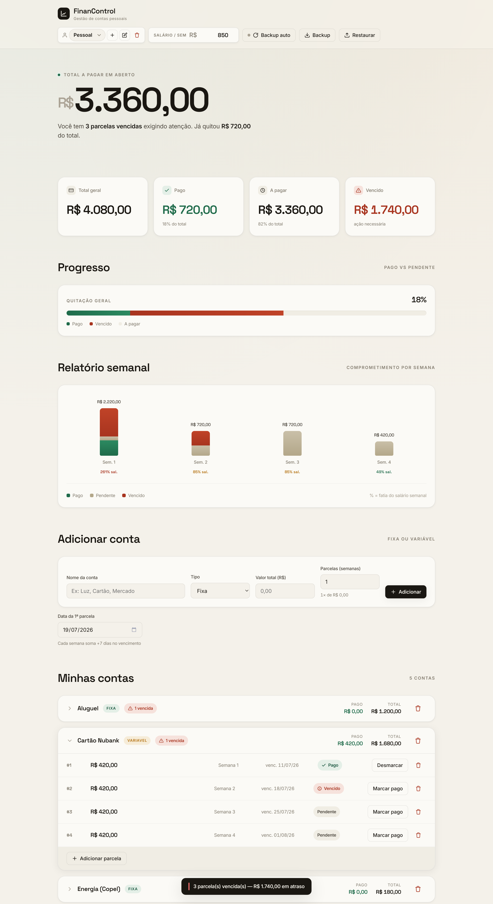
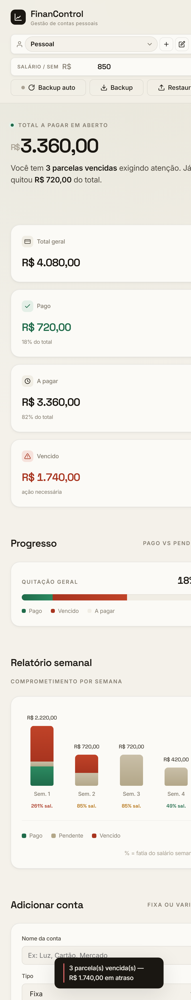

# FinanControl — Controle Financeiro Pessoal

> Aplicativo desktop para gerenciar contas pessoais, parcelar despesas por semana e acompanhar o que está pago, pendente e vencido — com backup automático em disco e múltiplos perfis.


---

## Preview

<p align="center">
  
</p>

<p align="center">
  
  <br>
  <em>Layout responsivo — do desktop ao celular (375px).</em>
</p>

---

## Visão geral

O **FinanControl** nasceu de uma necessidade real: organizar contas fixas e variáveis,
dividir despesas em parcelas semanais e enxergar rapidamente a saúde financeira do mês.

Roda como **aplicativo desktop** no Windows: um duplo-clique no executável sobe um servidor
local em Python e abre a interface numa **janela dedicada** (modo aplicativo, sem abas nem
barra de endereço), com a cara de um app instalado.

Toda a interface é **HTML/CSS/JavaScript puro** — sem frameworks, sem build de front-end,
sem dependências externas em runtime.

---

## Funcionalidades

- 💸 **Contas fixas e variáveis** — cadastro com valor total e parcelamento automático em semanas
- 📅 **Parcelas semanais** — vencimento calculado automaticamente (+7 dias por semana)
- ✅ **Controle de pagamento** — marcar/desmarcar parcelas como pagas
- 📊 **Dashboard** — total, pago, a pagar e vencido, com barra de progresso e count-up animado
- 📈 **Relatório semanal** — gráfico de barras empilhadas com o comprometimento do salário por semana
- ⚠️ **Alertas de vencimento** — destaque visual e aviso das parcelas em atraso ao abrir
- 👥 **Múltiplos perfis** — dados isolados por perfil (ex: pessoal, empresa), com criar/renomear/excluir
- 💾 **Backup automático** — grava em disco a cada alteração; mantém 7 snapshots diários e poda os antigos
- 🔄 **Backup manual** — exportar/importar em JSON (compatível entre versões)
- 📱 **Responsivo** — funciona bem de 375px (celular) ao desktop
- ♿ **Acessível** — contraste AA, foco visível, `prefers-reduced-motion`, rótulos ARIA

---

## Como usar

### Opção 1 — Executável (recomendado, Windows)

1. Baixe o `FinanControl.exe` na aba [**Releases**](../../releases).
2. Dê um duplo-clique.
3. O app abre numa janela dedicada. Os backups são gravados **na mesma pasta do executável**.
4. Feche a janela de console para encerrar.

> O backup automático fica ativo sozinho neste modo — sem configurar nada.

### Opção 2 — Só o HTML (qualquer sistema)

Abra o `FinanControl.html` no navegador. Os dados ficam salvos no `localStorage`.
Neste modo, o backup automático em disco usa a **File System Access API** (Chrome/Edge),
com fallback para backup manual.

---

## Rodar a partir do código

```bash
# Requisito: Python 3.10+
python server.py
```

Acesse `http://localhost:8756`. O servidor serve a interface e grava os backups em disco.

### Gerar o executável

```bash
pip install pyinstaller
# Windows:
build.bat
```

O executável final fica em `dist/FinanControl.exe`.

---

## Arquitetura

```
FinanControl.html   → Interface completa (UI + lógica + estado em localStorage)
server.py           → Servidor local (HTTP), API de backup em disco e modo aplicativo
build.bat           → Empacota tudo num único .exe com PyInstaller
```

**Fluxo de dados**

- O estado (perfis, contas, parcelas) vive no `localStorage` do navegador.
- A cada alteração, um _debounce_ dispara a gravação do backup:
  - **Modo app**: `POST /api/backup` → o Python grava `financontrol-backup.json` + snapshot diário.
  - **Modo navegador**: File System Access API grava direto na pasta escolhida.
- Ao abrir, se não houver dados locais, o app **recupera do backup em disco** — evitando perda de dados.

**Modelo de dados**

```jsonc
{
  "version": 2,
  "activeProfileId": "abc123",
  "profiles": [
    {
      "id": "abc123",
      "nome": "Pessoal",
      "salarioSemanal": 500,
      "contas": [
        {
          "id": "xyz789",
          "nome": "Luz",
          "tipo": "fixa",
          "parcelas": [
            { "num": 1, "valor": 100, "semana": 1, "vencimento": "2026-07-18", "pago": false }
          ]
        }
      ]
    }
  ]
}
```

---

## Stack técnica

| Camada | Tecnologia |
|--------|-----------|
| Interface | HTML5, CSS3 (custom properties, grid, clamp), JavaScript ES6+ (vanilla) |
| Backend local | Python 3 (`http.server`, stdlib apenas) |
| Empacotamento | PyInstaller |
| Persistência | `localStorage` + arquivos JSON em disco |

Sem dependências externas em runtime. Design system próprio inspirado em interfaces
fintech modernas (Linear / Mercury / Ramp).

---

## Roadmap

- [ ] Contas recorrentes **mensais** (ex: planos de telefonia)
- [ ] Edição inline de contas existentes
- [ ] Tema claro/escuro alternável
- [ ] Exportação de relatório em PDF

---

## Licença

[MIT](LICENSE) © 2026 João Vitor da Rosa Pimentel
